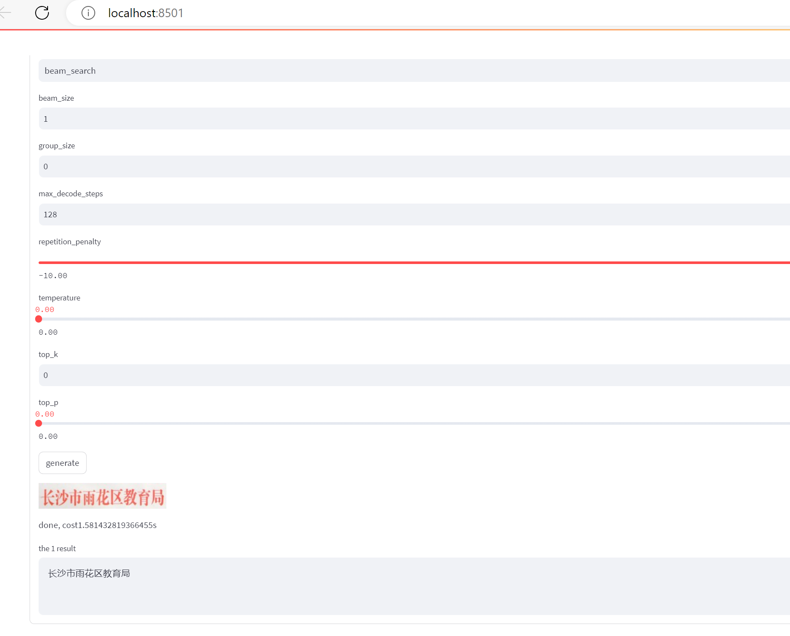

# Chinese text recognition

This repo trained Chinese text recognition model. **The model is designed for Chinese text recognition of single line and is suitable for scene, web and document data. It may not works well with handwriting data . For multiple lines text image, You need to use a text detector. **

|          | ACC/NED       |
| -------- | ------------- |
| Scene    | 0.6676/0.8094 |
| Web      | 0.6567/0.8031 |
| Document | 0.9700/0.9923 |



If you want to use the model and code, please refer to https://github.com/yaoxiaoyuan/mimix.

```
@misc{mimix,
  title={mimix},
  author={Xiaoyuan Yao},
  year={2021}
}
```

